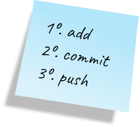

# Lab 3

Denne uken skal vi gjøre ferdig en ballsimulering: 

## Læringsmål

* Klone, committe og pushe med git
* Implementere et objekt 
* Lese og skrive til variabler
* Implementere og bruke konstruktører
* Beskrive en abstraksjon

Du skal implementere ferdig klassen Ball.
Du skal oppleve at den koden du jobber med er avhengig av mange andre klasser og at du dermed må ha en viss
forståelse av hvordan disse klassene fungerer for å kunne gjøre ferdig koden i Ball.
Men du trenger ikke forstå all koden, prøv deg frem og les kommentarene heller enn koden.

## 2.1 Push fiks for kompileringsfeil til GitLab
Bruk litt tid på å gjøre deg kjent med koden og testene før du går videre. 

### 2.1.1 Få koden til å kompilere
Den utleverte koden har kompileringsfeil. Prøv å kjøre programmet og testene og se hva som skjer.

Fiks kompileringsfeilene slik at programmet kompilerer og kjører. Programmet er ikke ferdig enda, og testene feiler fremedeles, men vi har kommet ett steg videre.

✅ Gå videre når programmet ikke har flere kompileringsfeil. 

### 2.1.2 `git add-commit-push`
Før du fortsetter å kode, er det en god idé å legge kodeendringen inn i git-repositoriet ditt. I denne deloppgaven skal du: 

- legge til kodeendringen din i git  
- commit kodeendringen din med en fornuftig commit message 
- pushe kodeendringen din til *ditt private git-repositorie* på GitLab 
- sjekke at commiten din kommer opp i historien til repositoriet ditt på GitLab

Både VS Code, Eclipse og Intellij har gode integrerte verktøy for å jobbe med git, men vi viser her hvordan vi gjør det i terminalen. Det går fint å bruke f. eks. den integrerte terminalen i VS Code til dette.

1. Naviger til mappen *lab3* hvor pom-filen ligger i terminalen.
2. Bruk de tre kommandoene under i rekkefølge:
    - `git add .`
    - `git commit -m "<skriv hva du har gjort>"`
    - `git push`

✅ Gå videre når committen med kompileringsfeil-fiksen din vises under `History` på ditt private GitHub repositorie for lab 2. 

#### Troubleshooting 
- Du har ikke skrivetilgang til public INF101 repositoriet. Pass på at du har klonet fra riktig sted. 
- Ved bruk av ``git push`` kan man få feilmeldingen: `` ! [rejected]        master -> master (non-fast-forward)``. Dette forekommer blant annet når det har blitt gjort endringer på prosjektet en annen plass slik at din versjon ikke er oppdatert. Prøv ``git pull`` og deretter ``git push`` igjen.

## 2.2 Implementer Ball-klassen
**Du skal KUN endre på Ball.java i denne labben.** Et unntak er beskrevet i siste oppgave.

Kjør BallTest-klassen og sjekk hvor mange tester som feiler. 

✅**Du er ferdig med denne oppgaven når alle testene passerer og programmet kjører som vist i filmen øverst i denne filen.**

Hvis du vil prøve å implementere koden uten å følge de detaljerte stegene vi beskriver her, står du fritt til det. Husk å legge koden din til git og pushe jevnlig. 

*Tips: Hvis du setter deg fast kan du alltids bruke git til å hente ut en tidligere versjon av programmet. Spør en medelev, Google eller gruppeleder for hjelp til det.*

### Steg-for-steg 
I denne oppgaven vil du måtte legge til feltvaribler og implementere metoder i klassen `Ball.java`. Start med å lese over koden og kommentarene og *skriv ditt eget notat*, enten digitalt eller analogt, som beskriver egenskapene til et Ball-objekt. Bruk f.eks. tankekart eller punktliste. Oppdater notatet ditt utover i oppgaven etter hvert som du forstår mer av hvordan koden henger sammen. 

**Tips: Se på både feltvariabler og metoder. Klassen mangler én feltvariabel, men metodene gir deg hint om hvilken.** 

✅ Legg til den manglende feltvariabelen i klassen `Ball.java`. (`add-commit-push`)

*NB: Husk å skrive javadoc på denne slik at den følger mønsteret til de andre feltvariablene.*

Deretter kan du begynne å implementere metodene. Vi anbefaler å begynne med de enkleste: `get`-metoder henter ofte bare ut verdier.
De stedene du skal implementere er merket med //TODO: I eclipse får du oversikt over alle //TODO: stedene ved å gå til Window -> Show View -> Tasks

✅ Implementer alle `get`-metodene i `Ball.java`. (`add-commit-push`)

Les dokumentasjonen til metodene for å se hva de skal gjøre. Du kan også sjekke hvordan testene bruker dem.

✅ Kjør testene: hvor mange feiler? Hvorfor feiler tester for metoder du allerede har implementert? 

*Selv om du implementerte alle get-metodene har du kanskje ikke gitt feltvariablene verdier enda?*

✅ Gjør ferdig konstruktøren, og kjør testene om igjen. (`add-commit-push`)

*Tips: Testene er ganske enkle, så det er kanskje en del feil i Ball som de ikke finner. Du kan teste testene ved å legge inn feil i metoder som har grønne tester, og se om testene blir røde.* 

Vi mangler enda noen metoder. Neste naturlige steg er å gjøre ferdig metodene som har med *movement* å gjøre. 

Du kan prøve å kjøre programmet nå; fra her og utover kan det være nyttig å *debugge* programmet ditt ved å se hvordan ballene oppfører seg på skjermen. 

✅ Gjør ferdig `move`, `moveTo`, `halt` og `accelerate`. Kjør testene og programmet om igjen. (`add-commit-push`)

Hvis du har gjort alt riktig frem til nå, så passerer alle testene, og programmet kjører nokså bra, bortsett fra noen `NullPointerExceptions`. Sjekk hvor de kommer fra ved å lese *stacktrace* i konsoll-vinduet. Hvorfor skjer feilen, og hvilken del av koden må du endre på for å fikse den? 

*Tips: du trenger ikke endre koden i BallDemo.*

Til slutt skal vi endre programmet slik at ballene "eksploderer" etter en viss tid, og blir til mange mindre baller.

Når en ball eksploderer vil det si at den deler seg i 8 mindre baller med halvparten så stor radius.
En stor ball med radius r har samme volum som 8 mindre baller med diameter r/2.
De 8 små ballene går i forskjellige (tilfeldige) retninger.

✅Gjør ferdig eksplosjons-metoden .(`add-commit-push`)

Det er ressurskrevende å tegne baller på skjermen så programmet kan gå tregt hvis vi tegner alle ballene.
En god strategi kan være å bare beholde de ballene som har diameter >= 4.
Det vil si at hvis en ball med diameter 4 eksploderer, så bare forsvinner den og explode metoden returnerer en tom tabell.

BallDemo har en feltvariabel maxNumberOfBalls, denne begrenser hvor mange baller som kan være på skjermen.
Hvis antall baller kommer over dene grensen slutter eksplosjonene å skje.
Om din PC har problemer med kjøringen kan det være nødvendig å senke denne grensen litt.

✅ Når programmet kjører, testene passerer og ballene på skjermen din ser ut som videoen i starten av dokumentet, så er du ferdig med kode-delen av oppgaven. 

✅ Hvis du i tillegg har gjort `git add-commit-push` og løsningen din kommer opp på ditt GitLab repositorie, så er du ferdig med Lab 2! Husk å levere oppgaven på MittUiB gjennom Codegrade. Sørg for at testene har passert og du har fått godkjent!

## 2.4 Valgfritt
Du kan gjerne fortsette å jobbe på denne oppgaven ved å, for eksempel: 

- endre farge på ballene 
- lage mer realistisk bounce-effekt
- spille av en lyd hver gang en ball bouncer eller eksploderer 
- implementere bounce av 'veggene' på vinduet i tillegg til gulvet

For å få til dette må du nok lese noe av koden BallDemo og gjøre endringer der.
Man lærer mye av å prøve å lese og forstå andres kode.

Lykke til :-)
